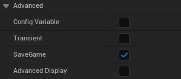

# Quickstart — From Zero to First Save

This guide takes you from a fresh plugin installation to a working save and load system. It assumes no prior knowledge of the plugin.

**Time to complete:** ~10 minutes

---

## Step 1 — Install the plugin

1. Close Unreal Engine if it's open.
2. Copy the `GYBSaveLoadSystem` folder into your project's `Plugins/` directory. Create the folder if it doesn't exist.
3. Open your project. UE5 will ask to rebuild missing modules — click **Yes**.
4. Go to **Edit → Plugins**, search for `GYBSaveLoadSystem`, and make sure it's enabled.
5. Restart the editor.

---

## Step 2 — Add the component to an actor

Pick any actor you want to save — a door, a character, a chest, anything.

1. Open the actor in the Blueprint editor.
2. Click **Add Component** and search for `GYBSaveableComponent`.
3. Add it.

> This component is what registers the actor with the plugin. Without it, the actor is invisible to the save system.

4. Select the component in the Components panel.
5. In the Details panel, set the **Unique ID** field to a name that identifies this actor — for example, `MainDoor` or `PlayerCharacter`.

> Every actor needs a unique ID. The plugin uses it to match saved data to the right actor when loading. If you leave it empty or duplicate it, things will break.

---

## Step 3 — Mark your variables with SaveGame

Open the actor's Blueprint. For each variable you want saved:

1. Select the variable in the **My Blueprint** panel.
2. In the Details panel, find the **SaveGame** checkbox and enable it.



That's all. You don't need to write any serialization code — the plugin picks up any variable with this flag automatically.

**Example:** If your door has an `bIsOpen` boolean and a `CurrentHealth` float, mark both with SaveGame and both will be saved.

> **Note:** Blueprint `float` variables are stored internally as `double` in UE5. The plugin handles this automatically — you don't need to do anything differently.

---

## Step 4 — Save the game

From any Blueprint — your player controller, a UI widget, a game mode — add the `GYB_SaveGame` node.

**Inputs:**
- `SlotIndex` — which slot to save to (0 to Max Save Slots - 1)
- `SlotName` — a display name for the slot, shown in your UI (e.g. `"Slot 1"`)

**Output:**
- `EGYBSaveResult` — `Success`, `SlotEmpty`, `FileCorrupted`, or `UnknownError`

```
[GYB_SaveGame] → SlotIndex: 0, SlotName: "My First Save"
      ↓
[Branch on Result] → Success → show "Game Saved" message
                   → anything else → show error
```

Always branch on the result. Don't assume the save succeeded.

---

## Step 5 — Load the game

Add the `GYB_LoadGame` node wherever you want to trigger a load — a main menu, a continue button, or on game start.

**Input:**
- `SlotIndex` — which slot to load from

**Output:**
- `EGYBSaveResult`

```
[GYB_LoadGame] → SlotIndex: 0
      ↓
[Branch on Result] → Success → continue
                   → SlotEmpty → show "No save found"
                   → FileCorrupted → show "Save data is corrupted"
```

When the load completes, every registered actor has its variables restored to the saved values. Runtime-spawned actors are respawned automatically before their data is applied.

> **Important:** The level does not reload. Data is restored directly onto the actors already in the world. If any actor has logic in `BeginPlay` that depends on its saved variables — for example, a door that sets its position based on `bIsOpen` — that logic won't re-run automatically. Use the `OnDataRestored` event instead. It fires on every registered actor right after its data is applied, and it's the right place to update visuals or trigger logic that depends on restored values.

---

## That's it

You now have a working save and load system. No C++ required, no engine modification, no custom serialization code.

---

## What's next

- **[Blueprint Node Reference](blueprint-reference.md)** — full reference for all six nodes with parameters and examples
- **[Integration Guide](integration-guide.md)** — saving the GameInstance, runtime actors, actor references, and building a save slot UI
- **[FAQ and Troubleshooting](faq.md)** — if something isn't working, start here
